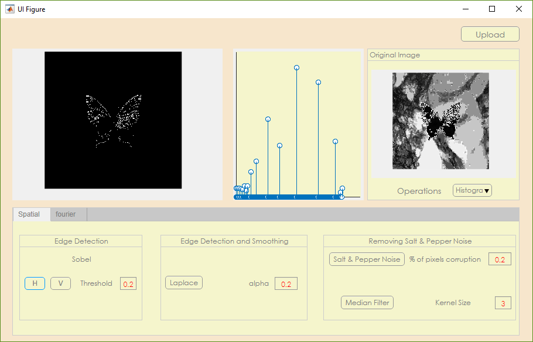
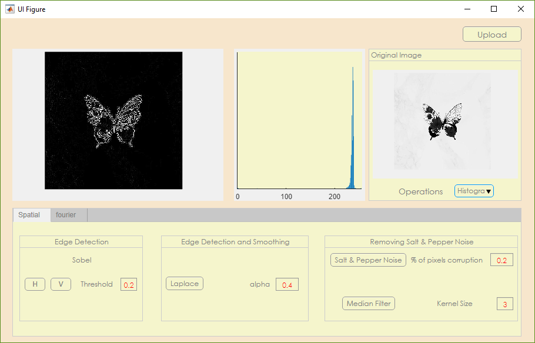
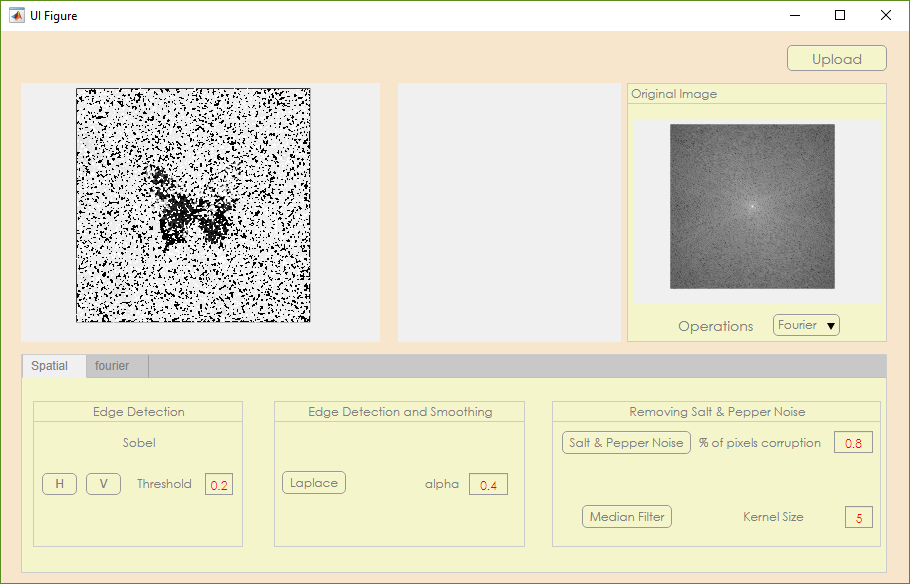
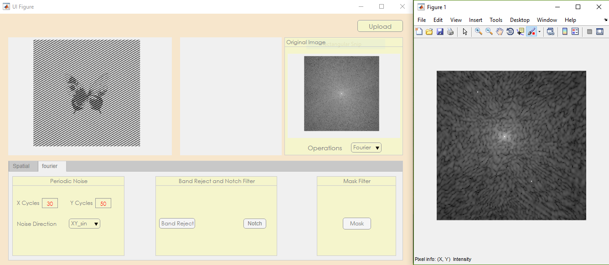

# image-processing-matlab-gui
### This is for the final project in medical image processing subject

## How to Use the GUI 
> 1) Upload the photo 
> 2) Pick one of the operations 
* **Sobel  [Choose Horizontal or Vertical / Choose threshold between 0-1 default is 0.2]**

* **Laplace[Choose alpha default is 0.2]**

* **Salt And Pepper[Choose the percentage of pixel corruption default is 20%]**4
* **Median filter default is 3*3**

* **Fourier :**
*Choose the number of cycles in x direction*
*Choose the number of cycles in y direction*
*Choose filtration technique by pressing on notch/bandwidth button*
*Press on mask button  a new window will open wait until the mouse shape changes then press on the middle of the picture to zoom in until you find the noisy pixels clear then press on the space bar and the mouse shape will again change you click on the two noisy pixels and the image is filtered*  

## Notes
1. Sobel threshold is between 0-1
2. Laplacian alpha is between 0-1
3.% of pixel corruption is between 0-1 (0-100%) 
4. Kernel size of median filter is between 1-+inf
5. If you canceled and didn’t upload image an error message will appear  

